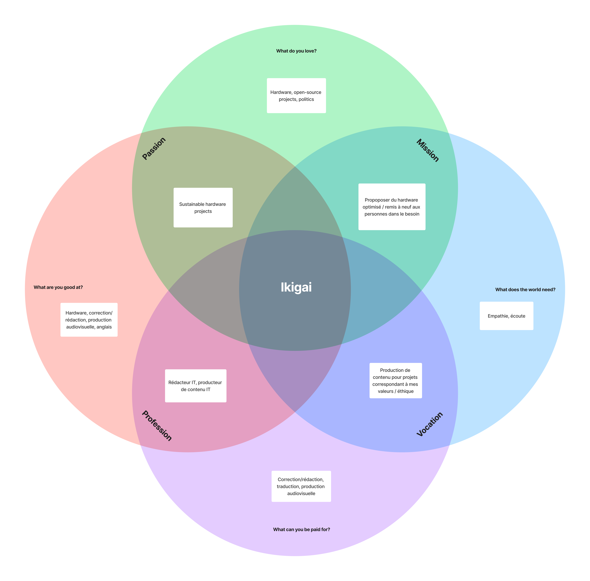

## Context
The purpose of this website is to create a space dedicated to digital awareness related to one of my passions, videography. This is actually an exercice, as in the real world, I'll be using two main tools to save my precious resources and build my digital awareness : browser bookmarks, linked to my Firefox account, and Youtube bookmarks, where you can actually create folders and order the videos you want to save.

## About Me
**_Sylvain Salgat_** Computer hardware and multimedia computer scientist in the process of updating into an audiovisual producer. Swiss Army knife of digital, multidisciplinary and disciplined. Spell checker on legs, apprentice editor.

During my free time, you can find myself running, drumming or fixing computers. Also trying new vegan recipes and probably failing miserably. But I'll eventually get there!

## My Ikigai

## Open Source Projects
|Project      |Role        |  Website   | GitHub     |
| ----------- |----------- |----------- |----------- |
| Packige | Co-creator    | https://packige.tapasprod.ch | https://github.com/SylvainSalgatHEIG/ProjArt-fromneibaf |
| Evolution of CO2 emissions from fossil fuels by country, from 1900 to 2014 | Creator | https://github.com/SylvainSalgatHEIG/ProjetVisualDon | https://github.com/SylvainSalgatHEIG/ProjetVisualDon |

## Work field table
|Domain      |Keywords        |  Subdomains   | Reasons     |
| ----------- |----------- |----------- |----------- |
| Digital content production | Articles, blog, social networks, video, photo    | Video production, photo production, article writing and editing, translation | Passion, skills |

